# 48-Hour Forward Chokepoint & Bottleneck Forecast Log
**UrbanPulse Operational Intelligence — Mumbai Arterial Corridor Sandbox**

- **Corridors Monitored:** Western Express Highway (WEH), Eastern Express Highway (EEH), Bandra–Worli Sea Link / Coastal Road (BWSL), Jogeshwari–Vikhroli Link Road (JVLR), Santacruz–Chembur Link Road (SCLR).
- **Monitoring Array:** 50 Spatio-Temporal Sensor Checkpoints (Sensors `1001` – `1050`).
- **Forecasting Model:** Spatio-Temporal Graph Convolutional Network (`SimpleSTGCN`), Horizon $H \in [1, 3]$ (5, 10, 15 min), rolling forward 48 hours.
- **Meteorological Context:** ERA5 Santacruz Reanalysis — Monsoon Transition Phase (Precipitation peaks up to $22.5\text{ mm/h}$, $88\%\text{ RH}$).

---

## 1. Executive Summary & Situational Context

This document captures the **48-hour forward simulation and operational forecast** generated by UrbanPulse for the Mumbai metropolitan arterial network. The objective is to demonstrate macroscopic traffic physics, kinematic shockwave propagation, and meteorological coupling across the city's primary north-south expressways and east-west connecting links.

Over the 48-hour simulation window:
1. **Asymmetric Tidal Congestion:** Southbound AM peaks demonstrate acute bottleneck deceleration at Bandra/BKC entries, dropping to $11 - 18\text{ km/h}$. Evening PM peaks reverse direction with severe suburban dispersal delays extending to Dahisar and Thane.
2. **Shockwave Queue Spillback:** Congestion at downstream bottlenecks (notably **Sensor 1013 - Kalanagar Junction**) generates an upstream shockwave traveling at $w_s \approx 17.8\text{ km/h}$, sequentially impacting Sensor 1012 (Teachers Colony) and Sensor 1011 (Khar Subway).
3. **Monsoon Cloudburst Disruption:** A localized heavy precipitation event ($22.5\text{ mm/h}$) simulated on Day 2 triggers an immediate $24\%$ drop in facility capacity across low-lying junctions (**Amar Mahal, Kurla Double Decker, Milan Subway**).

---

## 2. Corridor Baseline Capacity & Velocity Profiles

| Corridor Tag | Corridor Name | Checkpoints | Free-Flow Speed ($v_f$) | Off-Peak Avg | AM Peak Avg (SB) | PM Peak Avg (NB) |
|---|---|:---:|:---:|:---:|:---:|:---:|
| **WEH** | Western Express Highway | 16 (1001–1016) | $70 - 80\text{ km/h}$ | $58.4\text{ km/h}$ | $18.2\text{ km/h}$ | $21.5\text{ km/h}$ |
| **EEH** | Eastern Express Highway | 14 (1017–1030) | $75 - 80\text{ km/h}$ | $61.2\text{ km/h}$ | $22.7\text{ km/h}$ | $24.1\text{ km/h}$ |
| **BWSL** | Coastal Road & Sea Link | 5 (1026–1030) | $80\text{ km/h}$ | $69.8\text{ km/h}$ | $44.5\text{ km/h}$ | $46.8\text{ km/h}$ |
| **JVLR** | Jogeshwari–Vikhroli Link | 7 (1031–1037) | $60 - 65\text{ km/h}$ | $45.1\text{ km/h}$ | $16.4\text{ km/h}$ | $17.8\text{ km/h}$ |
| **SCLR** | Santacruz–Chembur Link | 8 (1038–1045) | $55 - 60\text{ km/h}$ | $42.6\text{ km/h}$ | $14.1\text{ km/h}$ | $15.5\text{ km/h}$ |

---

## 3. Chronological 48-Hour Forecast Timeline

```mermaid
gantt
    title 48-Hour Mumbai Arterial Traffic States
    dateFormat HH:mm
    axisFormat %H:%M
    section Day 1
    Night Free-Flow (55-75 km/h)           :done, 00:00, 06:30
    AM Peak Inflow - SoBo/BKC (14-22 km/h)  :active, 06:30, 11:30
    Inter-Peak Steady State (38-48 km/h)   :08:00, 16:30
    PM Peak Dispersal - Suburbs (16-24 km/h):crit, 16:30, 21:30
    Night Recovery                         :21:30, 24:00
    section Day 2
    Night Free-Flow                        :00:00, 06:00
    Pre-Monsoon Humid Buildup              :06:00, 08:30
    Heavy Monsoon Cloudburst (Rain Atten)  :crit, 08:30, 14:00
    Waterlogging Delay Spillback           :active, 14:00, 19:30
    Post-Monsoon Gradual Drain             :19:30, 24:00
```

### Day 1: Typical Dry-Season Business Day Cycle

#### 00:00 – 06:30 | Free-Flow & Heavy Freight Window
- **Corridor Behavior:** Minimum traffic friction. Freight and port container vehicles moving along EEH from Nhava Sheva / Wadala.
- **Operating Speeds:** Expressways operating at $65 - 75\text{ km/h}$. BWSL operating near design cap ($76\text{ km/h}$).
- **ST-GCN Prediction Confidence:** Low variance, $e_{\text{MAE}} < 1.4\text{ km/h}$.

#### 06:30 – 11:30 | Morning Peak Inflow (Southbound Congestion Surge)
- **Primary Chokepoints:**
  - **Sensor 1013 (WEH - Kalanagar):** Plunges from $64\text{ km/h}$ at 07:15 down to $12.8\text{ km/h}$ at 09:30.
  - **Sensor 1023 (EEH - Chedda Nagar):** Merging conflict between Eastern Freeway and Ghatkopar traffic causes speeds to drop to $15.2\text{ km/h}$.
  - **Sensor 1047 (SCLR - Kurla LBS Flyover):** Severe gridlock on east-west connector ($11.4\text{ km/h}$).
- **Upstream Shockwave Spillback:**
  - Deceleration wave propagates upstream along WEH Southbound:
    $$\Delta t = \frac{\Delta x}{w_s} = \frac{1.9\text{ km}}{18\text{ km/h}} \approx 6.3\text{ minutes}$$
  - Sensor 1012 (Teachers Colony, 0.8 km upstream) slows down by 09:37.
  - Sensor 1010 (Milan Flyover, 3.4 km upstream) exhibits queue tail formation by 09:48.

#### 11:30 – 16:30 | Midday Inter-Peak Stabilization
- Traffic demand levels out; speeds rebound to $35 - 45\text{ km/h}$ across arterial sections.
- BWSL maintains smooth high-speed transit ($60 - 70\text{ km/h}$).

#### 16:30 – 21:30 | Evening Peak Dispersal (Northbound Congestion Surge)
- Tidal inversion: Commuters returning from Nariman Point, Lower Parel, and BKC toward Goregaon, Borivali, and Thane.
- **Acute Decelerations:**
  - Sensor 1007 (WEH - Jogeshwari JVLR Jn): Inter-corridor turning movements reduce throughput; velocity stabilizes at $16.5\text{ km/h}$.
  - Sensor 1020 (EEH - Kanjurmarg): Heavy backup extending towards Mulund Toll Plaza ($19.1\text{ km/h}$).

---

### Day 2: Monsoon Surge & Roadway Waterlogging Event

#### 08:30 – 13:00 | Simulated Severe Monsoon Downpour ($22.5\text{ mm/h}$)
- **Weather Synchronous Input:** Atmospheric relative humidity surges to $94\%$, visibility falls to $1,800\text{ m}$, precipitation rate hits $22.5\text{ mm/h}$.
- **Physically Grounded Speed Attenuation:**
  $$\Phi_{\text{rain}}(t) = 1.0 - 0.018 \cdot 22.5 \approx 0.595 \quad (-40.5\%\text{ theoretical capacity})$$
- **Corridor Impacts:**
  - **WEH Low Points (Sensor 1010 - Milan Subway vicinity & Sensor 1011):** Surface runoff accumulation limits speeds to $8 - 14\text{ km/h}$.
  - **EEH Amar Mahal Junction (Sensor 1024):** Water stagnation causes complete junction saturation; queues back up into Chembur.
  - **Coastal Road / BWSL (Sensors 1026–1030):** High crosswinds ($38\text{ km/h}$) and rain sheeting lower speeds from $75\text{ km/h}$ to $42\text{ km/h}$.

#### 14:00 – 24:00 | Recovery & Water Recession
- Rain intensity attenuates to light drizzle ($1.2\text{ mm/h}$). Municipal pumping and natural drainage restore arterial capacity over a 4-hour recovery lag.

---

## 4. Multi-Horizon Chokepoint Forecast Matrix

ST-GCN forward forecasts at peak hour ($T_0 = \text{Day 1, 09:30 AM}$) across the 5 most critical network bottlenecks:

| Sensor ID | Landmark Location | Corridor | Actual Speed ($T_0$) | Forecast $T_0 + 5\text{m}$ | Forecast $T_0 + 15\text{m}$ | Forecast $T_0 + 30\text{m}$ | Forecast Status |
|:---:|---|:---:|:---:|:---:|:---:|:---:|:---:|
| **1013** | WEH - Kalanagar Chokepoint | WEH | $13.2\text{ km/h}$ | $12.9\text{ km/h}$ | $11.8\text{ km/h}$ | $14.2\text{ km/h}$ | **Severe Bottleneck** |
| **1010** | WEH - Milan Flyover Approach | WEH | $21.5\text{ km/h}$ | $18.6\text{ km/h}$ | $14.3\text{ km/h}$ | $12.7\text{ km/h}$ | **Impending Spillback** |
| **1023** | EEH - Chedda Nagar Junction | EEH | $15.4\text{ km/h}$ | $14.8\text{ km/h}$ | $13.7\text{ km/h}$ | $16.1\text{ km/h}$ | **Heavy Congestion** |
| **1037** | JVLR - Powai Lake Central | JVLR | $17.1\text{ km/h}$ | $16.5\text{ km/h}$ | $15.2\text{ km/h}$ | $17.8\text{ km/h}$ | **Sustained Slowdown** |
| **1047** | SCLR - Kurla LBS Flyover | SCLR | $11.8\text{ km/h}$ | $11.2\text{ km/h}$ | $10.5\text{ km/h}$ | $12.4\text{ km/h}$ | **Gridlock Risk** |

---

## 5. Automated Traffic Operations Advisory

Based on model inferences across the 48-hour horizon, the UrbanPulse forecasting engine recommends the following operational interventions:

1. **Dynamic VMS Diversion at Kalanagar (08:45 – 10:30):** Divert Southbound WEH airport traffic via Western Railway parallel roads (S.V. Road) before traffic reaches the Milan subway tail.
2. **East-West Connector Metering (JVLR / SCLR):** Throttle ingress signals onto SCLR from Kurla West when SCLR speed drops below $12\text{ km/h}$ to avoid full arterial deadlock.
3. **Monsoon Sump Pump Pre-Activation:** Trigger automated storm drainage pumps at Milan Subway, Amar Mahal, and Vakola 30 minutes before heavy precipitation reaches $> 15\text{ mm/h}$ according to ERA5 forward weather forecast.
